```mermaid
flowchart TD
    %% Main Application Structure
    App["App (Root)"]
    
    %% Layout Components
    Layout["Layout"]
    Header["Header/Navbar"]
    Footer["Footer"]
    Sidebar["Sidebar"]
    
    %% Authentication Components
    AuthModule["Auth Module"]
    LoginForm["Login Form"]
    SignupForm["Signup Form"]
    PasswordReset["Password Reset"]
    SocialLogin["Social Login Buttons"]
    
    %% Main Feature Modules
    HomeModule["Home Module"]
    DashboardModule["Dashboard Module"]
    ProfileModule["Profile Management"]
    OpportunitiesModule["Opportunities Module"]
    InternshipsModule["Internships & Problems"]
    TeamsModule["Teams Module"]
    ChatModule["Chat Module"]
    NotificationsModule["Notifications Module"]
    ApplicationsModule["Applications Module"]
    CompanyModule["Company Module"]
    PostModule["Post Module"]
    QAModule["QA Module"]
    ContactModule["Contact Module"]
    LandingPageModule["Landing Page Module"]
    
    %% Home Components
    HomeView["Home View"]
    Stats["Statistics/Overview"]
    RecentActivities["Recent Activities"]
    
    %% Dashboard Components
    DashboardView["Dashboard View"]
    DashboardStats["Dashboard Statistics"]
    DashboardActivities["Dashboard Activities"]
    
    %% Profile Components
    ProfileView["Profile View"]
    ProfileEdit["Profile Edit"]
    ProfileSettings["Profile Settings"]
    
    %% Opportunities Components
    OpportunityList["Opportunity List"]
    OpportunityCard["Opportunity Card"]
    OpportunityDetail["Opportunity Detail"]
    OpportunityFilter["Opportunity Filters"]
    ApplyForm["Application Form"]
    
    %% Teams Components
    TeamsList["Teams List"]
    TeamDetail["Team Detail"]
    TeamCreate["Team Creation"]
    TeamJoin["Team Join"]
    TeamMembers["Team Members"]
    
    %% Chat Components
    ChatList["Conversations List"]
    ChatWindow["Chat Window"]
    MessageInput["Message Input"]
    MessageBubble["Message Bubble"]
    
    %% Notification Components
    NotificationList["Notification List"]
    NotificationItem["Notification Item"]
    
    %% Application Components
    ApplicationList["Applications List"]
    ApplicationDetail["Application Detail"]
    ApplicationStatus["Application Status"]
    
    %% Company Components
    CompanyList["Company List"]
    CompanyDetail["Company Detail"]
    CompanyProfile["Company Profile"]
    
    %% Post Components
    PostList["Post List"]
    PostDetail["Post Detail"]
    PostCreate["Post Creation"]
    
    %% QA Components
    QAList["QA List"]
    QADetail["QA Detail"]
    QACreate["QA Creation"]
    
    %% Contact Components
    ContactForm["Contact Form"]
    ContactInfo["Contact Information"]
    
    %% Landing Page Components
    HeroSection["Hero Section"]
    FeaturesSection["Features Section"]
    AboutSection["About Section"]
    
    %% Shared Components
    SharedComponents["Shared Components"]
    Buttons["Button Components"]
    Forms["Form Components"]
    Modals["Modal Components"]
    Cards["Card Components"]
    Loaders["Loading Components"]
    Pagination["Pagination Components"]
    
    %% UI Component Library
    UILibrary["UI Component Library"]
    RadixUI["Radix UI Components"]
    TailwindComponents["Tailwind Components"]
    
    %% Component Hierarchy
    App --> Layout
    
    Layout --> Header
    Layout --> Footer
    Layout --> Sidebar
    Layout --> AuthModule
    Layout --> HomeModule
    Layout --> DashboardModule
    Layout --> ProfileModule
    Layout --> OpportunitiesModule
    Layout --> InternshipsModule
    Layout --> TeamsModule
    Layout --> ChatModule
    Layout --> NotificationsModule
    Layout --> ApplicationsModule
    Layout --> CompanyModule
    Layout --> PostModule
    Layout --> QAModule
    Layout --> ContactModule
    Layout --> LandingPageModule
    
    AuthModule --> LoginForm
    AuthModule --> SignupForm
    AuthModule --> PasswordReset
    AuthModule --> SocialLogin
    
    HomeModule --> HomeView
    HomeView --> Stats
    HomeView --> RecentActivities
    
    DashboardModule --> DashboardView
    DashboardView --> DashboardStats
    DashboardView --> DashboardActivities
    
    ProfileModule --> ProfileView
    ProfileModule --> ProfileEdit
    ProfileModule --> ProfileSettings
    
    OpportunitiesModule --> OpportunityList
    OpportunityList --> OpportunityCard
    OpportunitiesModule --> OpportunityDetail
    OpportunitiesModule --> OpportunityFilter
    OpportunitiesModule --> ApplyForm
    
    InternshipsModule --> OpportunityList
    
    TeamsModule --> TeamsList
    TeamsModule --> TeamDetail
    TeamsModule --> TeamCreate
    TeamsModule --> TeamJoin
    TeamDetail --> TeamMembers
    
    ChatModule --> ChatList
    ChatModule --> ChatWindow
    ChatWindow --> MessageInput
    ChatWindow --> MessageBubble
    
    NotificationsModule --> NotificationList
    NotificationList --> NotificationItem
    
    ApplicationsModule --> ApplicationList
    ApplicationsModule --> ApplicationDetail
    ApplicationDetail --> ApplicationStatus
    
    CompanyModule --> CompanyList
    CompanyModule --> CompanyDetail
    CompanyModule --> CompanyProfile
    
    PostModule --> PostList
    PostModule --> PostDetail
    PostModule --> PostCreate
    
    QAModule --> QAList
    QAModule --> QADetail
    QAModule --> QACreate
    
    ContactModule --> ContactForm
    ContactModule --> ContactInfo
    
    LandingPageModule --> HeroSection
    LandingPageModule --> FeaturesSection
    LandingPageModule --> AboutSection
    
    %% Shared Components
    App --> SharedComponents
    SharedComponents --> Buttons
    SharedComponents --> Forms
    SharedComponents --> Modals
    SharedComponents --> Cards
    SharedComponents --> Loaders
    SharedComponents --> Pagination
    
    App --> UILibrary
    UILibrary --> RadixUI
    UILibrary --> TailwindComponents
    
    %% Styling
    classDef primary fill:#2563eb,stroke:#1e40af,color:white;
    classDef secondary fill:#4f46e5,stroke:#4338ca,color:white;
    classDef tertiary fill:#64748b,stroke:#475569,color:white;
    classDef module fill:#fbbf24,stroke:#f59e0b,color:black;
    
    class App,Layout primary;
    class Header,Footer,Sidebar secondary;
    class AuthModule,HomeModule,DashboardModule,ProfileModule,OpportunitiesModule,InternshipsModule,TeamsModule,ChatModule,NotificationsModule,ApplicationsModule,CompanyModule,PostModule,QAModule,ContactModule,LandingPageModule module;
    class SharedComponents,UILibrary module;
```

## Component Hierarchy Diagram - Explanation

This diagram represents the hierarchical structure of React components in your application, showing how components are nested and organized.

### Main Structure
- **App (Root)**: The top-level component that renders everything else
- **Layout**: Handles the overall page structure with Header, Footer, and Sidebar
- **Feature Modules**: Separate modules for each major feature of the application

### Key Component Groups

#### Authentication Components
Components handling user authentication including login, signup, password reset, and social logins.

#### Feature-specific Components
Each module contains its own set of components that handle specific functionality:
- **Home & Dashboard**: Overview components for the home page and dashboard
- **Profile**: Components for viewing and editing user profiles
- **Opportunities/Internships**: Components for listing, filtering, and viewing opportunities
- **Teams**: Components for team management
- **Chat**: Components for messaging functionality
- **Notifications**: Components for displaying system notifications
- **Applications**: Components for tracking application status
- **Company**: Components for company profiles and management
- **Post**: Components for post creation and management
- **QA**: Components for Q&A functionality
- **Contact**: Components for contact information and forms
- **Landing Page**: Components for the public landing page

#### Shared Components
Reusable components used across multiple features:
- Buttons, Forms, Modals, Cards, Loaders, Pagination

#### UI Component Library
Third-party UI components integrated into the application:
- Radix UI components
- Tailwind CSS components

### Implementation Notes

This diagram helps developers understand:
- How components are organized and connected
- Which components are reused across features
- The modularity of the application architecture

The diagram follows the actual module structure found in your codebase, ensuring it accurately represents your application's architecture. 