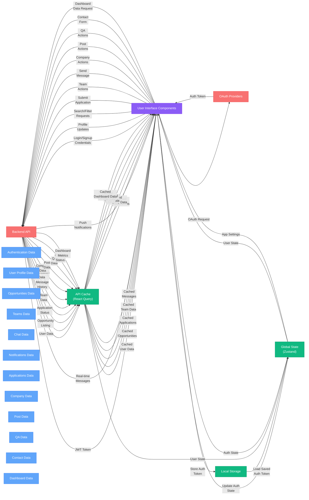

## Data Flow Diagram - Explanation

This diagram illustrates how data flows through your application, showing the interactions between UI components, state management, and backend services.

### Key Components

#### External Systems
- **Backend API**: Your server-side application handling data persistence and business logic
- **OAuth Providers**: External authentication services (Google, LinkedIn)

#### Client-Side Data Stores
- **Zustand Store**: Global state management for app-wide state
- **React Query Cache**: Client-side cache for API responses
- **Local Storage**: Browser storage for persisting data between sessions

#### Data Categories
- **Authentication Data**: User credentials, JWT tokens
- **User Profile Data**: Personal information, settings
- **Opportunities Data**: Available opportunities, details
- **Teams Data**: Team information, memberships
- **Chat Data**: Conversation history, messages
- **Notifications Data**: System notifications
- **Application Data**: Submitted applications, status
- **Company Data**: Company profiles and information
- **Post Data**: Post content and metadata
- **QA Data**: Questions and answers
- **Contact Data**: Contact form submissions
- **Dashboard Data**: Analytics and metrics

### Main Data Flows

#### Authentication Flow
1. User submits credentials via UI
2. Credentials sent to Backend or OAuth providers
3. Authentication token returned
4. Token stored in Local Storage and Zustand store
5. Authenticated state maintained across app

#### Data Retrieval Flow
1. UI components request data
2. React Query checks cache for data
3. If not available/stale, request sent to Backend
4. Backend returns data
5. Data cached in React Query
6. Data displayed in UI components

#### Data Modification Flow
1. User makes changes via UI
2. Changes sent to Backend
3. Backend processes and stores changes
4. Updated data returned
5. Cache and state updated
6. UI reflects changes

### Implementation Notes

This diagram helps developers understand:
- How data moves through the application
- Where data is stored
- How different parts of the application interact
- The role of state management and caching

The architecture follows modern React best practices, using Zustand for global state and React Query for server state management. 