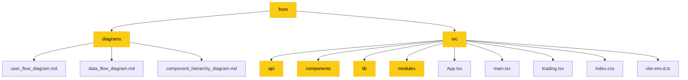

## Project Structure Diagram - Explanation

This diagram visualizes the key directories and files in your project's `front` directory.

- **front**: The root directory of the frontend.
- **diagrams**: Contains the project's documentation diagrams.
- **src**: Contains the main source code of the application.
- **api**: Likely contains API client code.
- **components**: Contains reusable UI components.
- **lib**: Contains utility functions or libraries.
- **modules**: Contains feature-specific modules.
- **App.tsx**: The root component of the application.
- **main.tsx**: The entry point of the application.
- **loading.tsx**: A loading component.
- **index.css**: Global CSS styles.
- **vite-env.d.ts**: Vite environment type definitions.
- **user_flow_diagram.md**: Diagram for user flows.
- **data_flow_diagram.md**: Diagram for data flows.
- **component_hierarchy_diagram.md**: Diagram for component hierarchy.

This diagram provides a high-level overview of the project's file organization. 