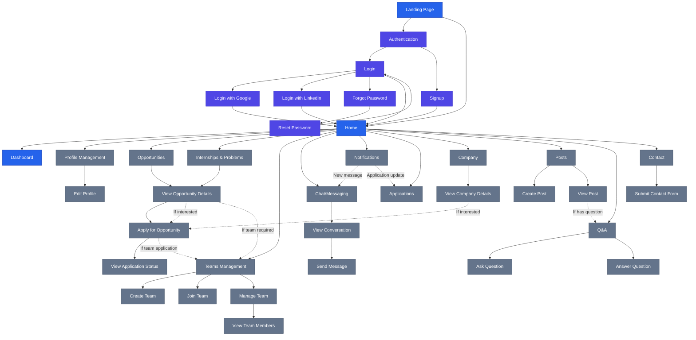

## User Flow Diagram - Textual Description

### Entry Points
- Users begin at the **Landing Page**
- They can either authenticate or proceed to the home page (if already logged in)

### Authentication Flow
- Authentication options include Login, Signup, or Social Login (Google/LinkedIn)
- Password recovery flow available through Forgot Password → Reset Password

### Main Navigation Areas
After authentication, users can access:
1. **Home** - Entry point to all features
2. **Dashboard** - Overview of user's activities and metrics
3. **Profile Management** - View and edit personal information
4. **Opportunities** - Browse and apply for available opportunities
5. **Internships & Problems** - Browse and apply for internships and problem-solving opportunities
6. **Teams Management** - Create, join, or manage teams
7. **Chat/Messaging** - Communicate with team members or opportunity providers
8. **Notifications** - View system notifications and updates
9. **Applications** - Track status of submitted applications
10. **Company** - View company profiles and information
11. **Posts** - Create and view posts
12. **Q&A** - Ask and answer questions
13. **Contact** - Submit contact forms and view contact information

### Key User Journeys

#### Opportunity Application Flow
1. User browses Opportunities/Internships
2. User views opportunity details
3. User applies for opportunity (may require team formation)
4. User tracks application status

#### Team Management Flow
1. User creates a new team or joins existing team
2. User manages team information and members
3. User communicates with team members through chat

#### Profile Management Flow
1. User views profile information
2. User edits profile details and preferences

#### Content Creation Flow
1. User creates posts or asks questions
2. Other users can view and interact with the content
3. Users can answer questions or comment on posts

#### Company Interaction Flow
1. User views company profiles
2. User can apply to opportunities from company pages
3. User can contact companies through the contact form

## Implementation Notes

This diagram can be visualized using:
- [Mermaid Live Editor](https://mermaid.live/)
- Diagramming tools like draw.io, Lucidchart, or Figma
- VS Code with Mermaid extension

For a more detailed or interactive diagram, consider using dedicated UX diagramming tools like Figma or Adobe XD. 